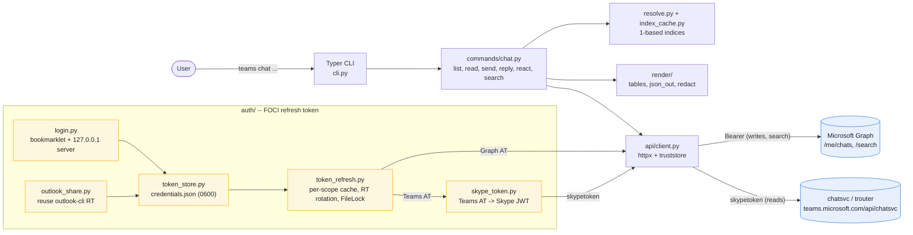

# ms-teams-cli

**Microsoft Teams chats from your terminal.** Read DMs, reply, react, mark read/unread, and search — without opening the Teams app.

[](https://www.python.org/downloads/)
[](LICENSE)
[](https://mypy-lang.org/)
[](https://github.com/astral-sh/ruff)

Built for daily-driver DM triage: list what's unread, act on it by number, get back to work. Every command speaks `--json`, so it pipes into `jq` — or into an agent (a [Claude Code skill](#claude-code-skill) ships in the repo).

```bash
teams chat list --unread --top 5
teams chat read 1
teams chat reply 3 --body "ack"
```

---

## Contents

- [Why](#why)
- [Quickstart](#quickstart)
- [Install](#install)
- [Authentication](#authentication)
- [Architecture](#architecture)
- [Commands](#commands)
- [Example workflows](#example-workflows)
- [JSON output](#json-output)
- [Exit codes](#exit-codes)
- [Claude Code skill](#claude-code-skill)
- [Development](#development)
- [Troubleshooting](#troubleshooting)
- [Disclaimer](#disclaimer)
- [License](#license)

## Why

The Teams desktop client is heavy, and its notification model assumes you live inside it. If your day is already in a terminal, a short unread list and a one-line reply beat a context switch. Concretely:

- **Index-based addressing.** `chat read 1`, `chat react 3 like` — no chat IDs on the command line.
- **Real unread control.** `mark-read` and `mark-unread --since 1h` move your own read horizon; nobody else sees anything.
- **Scriptable by default.** `--json` on every command, with published JSON Schemas that are validated in CI.
- **Survives corporate tenants.** Reads fall back to the same chatsvc API the Teams web client uses, so it works where Graph `Chat.Read*` isn't preauthorized.

## Quickstart

```bash
# 1. Install (one-time)
uv sync --all-extras

# 2. Sign in (one-time; ~90 day validity, auto-rotates)
#    If you already have outlook-cli logged in, the CLI offers to reuse those credentials.
teams login

# 3. List recent chats
teams chat list --unread --top 10

# 4. Act on a chat by index
teams chat read 1
teams chat reply 3 --body "ack"   # 3 is a *message* index from the previous read
teams chat react 3 like

# 5. Send a DM to someone by email (creates a 1:1 chat if one doesn't exist)
teams chat send alice@example.com --body "lgtm"

# 6. Manage unread state (per-user; other chat members see nothing)
teams chat mark-read 1                       # clear the unread badge
teams chat mark-unread 1 --since "1h"        # only the last hour reappears as unread

# 7. Search across chats
teams chat search "Q3 planning"

# 8. Machine-readable output (for scripting / Claude)
teams --json chat list | jq '.items[] | select(.has_unread) | .members[0].email'
```

## Install

Requires Python 3.11+ and [uv](https://docs.astral.sh/uv/).

```bash
uv tool install ms-teams-cli
# or, in this repo:
uv sync --all-extras
uv run teams --help
```

## Authentication

```bash
teams login
```

What happens:

1. The CLI checks for `~/.config/outlook-cli/credentials.json`. If present and the refresh token can mint a Teams-scope AAD token (FOCI), you'll be prompted to reuse it — no second bookmarklet.
2. Otherwise the CLI binds a one-shot HTTP server on a free 127.0.0.1 port and prints a URL plus a one-line JavaScript bookmarklet.
3. Open `https://teams.microsoft.com/v2/` in your normal browser, sign in (corporate SSO / MFA / Conditional Access — your real session, so every check passes), then click the bookmarklet from your bookmarks bar.
4. The bookmarklet collects only the MSAL credential and account entries from localStorage (Teams keeps megabytes of unrelated app state there, which would overflow the browser's URL length limit) and calls `window.open('http://127.0.0.1:PORT/auth#<payload>', '_blank')`. A new tab opens on the CLI's localhost page, reads the payload from its own URL fragment, and POSTs it to `/submit` (same-origin, so no CSP applies). The tab shows a green "Success!" message; the CLI parses the MSAL.js refresh-token entry and writes `~/.config/teams-cli/credentials.json` (`0600` on POSIX).

> Why a new-tab localhost handoff instead of a plain `fetch()` from Teams? Teams 2.0's Content Security Policy blocks `connect-src` and `form-action` to any local loopback port. `window.open` is *navigation* — CSP doesn't restrict it — and the URL fragment (`#...`) never travels in the HTTP request from the Teams page, so the payload survives. The new tab loads from the CLI's own server, so its inline `fetch('/submit', ...)` is same-origin and unaffected by Teams' CSP.

The refresh token is valid ~90 days, rotates automatically on use, and may be revoked by tenant policy at any time.

```bash
teams whoami           # print signed-in account
teams logout           # delete credentials and caches
```

| Flag on `teams login` | Effect |
|---|---|
| `--reuse-outlook-cli` | Reuse outlook-cli's credentials non-interactively (useful for scripts) |
| `--no-share` | Force the bookmarklet flow even when outlook-cli is logged in |
| `--timeout <seconds>` | How long to wait for the bookmarklet POST (default 300) |

## Architecture



### Implementation notes

- **CLI**: [Typer](https://typer.tiangolo.com/) for the command surface, [Rich](https://github.com/Textualize/rich) for tables, Pydantic v2 for typed models. Python ≥ 3.11, `mypy --strict`, `ruff` for lint/format.
- **HTTP**: a single `httpx.Client` in `api/client.py` injects the right credential per surface — Bearer for Graph, Bearer for `teams.microsoft.com/api`, and `Authentication: skypetoken=…` (not Bearer) for chatsvc.
- **Dual-adapter reads/writes**: `WebChats` (chatsvc/trouter) handles `list` and `read`, because many corporate tenants have not preauthorized Graph `Chat.Read*` for the Teams Web Client. `GraphChats` handles `send`/`reply`/`react`/`search`/`ensure-one-on-one` — those scopes (`ChatMessage.Send`, Search) *are* preauthorized. `react` and `mark-read`/`mark-unread` additionally fall back to chatsvc on Graph 403, so they work on tenants that block `Chat.ReadWrite` for the Teams Web Client; the `via` field in `--json` output reports which path succeeded.
- **Auth (FOCI)**: one MSAL refresh token mints both Graph and Teams access tokens (Family-of-Client-IDs); the Teams AT is then exchanged for a Skype JWT via `authsvc`. `TokenRefresher` caches per scope with `filelock` + atomic file replace, and rotates the RT in `credentials.json` whenever AAD returns a new one.
- **Bookmarklet login**: bypasses Teams' CSP by leaning on three browser behaviors — (a) `window.open()` is navigation, not `connect-src`; (b) URL fragments stay client-side; (c) the new tab loads from `127.0.0.1`, so its own `fetch('/submit')` is same-origin. Credentials file is `0600` on POSIX.
- **Index cache**: `chat list`/`search` writes a short `ChatListing` JSON; `chat read` writes a `MessageListing`. Subsequent commands (`read N`, `react N`, `reply N`) resolve 1-based ints against the most recent listing — no chat-id juggling on the command line.
- **JSON output**: every command supports `--json`; schemas are exposed via `--json-schema NAME` and validated in tests with `jsonschema`. Top-level keys are frozen post v1.0.
- **Resilience**: `api/retries.py` retries idempotent reads on 429/5xx with jittered backoff; `errors.py` maps Graph/chatsvc errors to typed `TeamsError` subclasses with stable exit codes (see below).
- **TLS**: `truststore` reads the OS cert store by default (handles Zscaler-style MITM proxies). `TEAMS_CLI_CA_BUNDLE` and `TEAMS_CLI_INSECURE` are escape hatches.
- **Logging**: `RedactingFilter` strips bearer/skype tokens and refresh tokens from log lines before they hit stderr (`-v` / `-vv`).
- **Tests**: `pytest` + `respx` (httpx mocking) + `syrupy` snapshots + `freezegun` + `hypothesis`; an `e2e` marker gated by `TEAMS_CLI_E2E` hits real Graph. Coverage gate: 80%.

## Commands

| Group | Commands |
|---|---|
| **Auth** | `login`, `logout`, `whoami` |
| **Chat (read)** | `list`, `read`, `search` |
| **Chat (write)** | `send`, `reply`, `react` (with `--unreact`), `mark-read`, `mark-unread` (with `--since`) |
| **Meta** | `version`, `--json-schema NAME`, `--json-schema --list` |

Run `teams chat --help` (or `--help` on any subcommand) for the full per-command surface.

### Index convention (read this once)

`teams` keeps two short-index caches:

- **Chat indices** — populated by `chat list` and `chat search`. Used by `chat read N` and `chat send N`.
- **Message indices** — populated by `chat read`. Used by `chat react N`, `chat reply N`, and `chat send --reply-to N`.

`chat react 3` means "the 3rd message in the chat I just read" — *not* "the 3rd chat". Indices are 1-based and reset whenever you re-list.

## Example workflows

### Daily DM triage

```bash
teams chat list --unread --top 20
teams chat read 1                # populates message-index cache
teams chat react 5 like          # like the 5th message in chat 1
teams chat reply 5 --body "ack"  # reply quotes the 5th message
teams chat mark-read 1           # clear the unread badge (e.g. after handling in another client)
```

### Unread bookkeeping

```bash
teams chat mark-read alice@example.com                      # clear by email
teams chat mark-unread 3                                    # mark a whole chat unread
teams chat mark-unread 3 --since "1h"                       # only the last hour is unread
teams chat mark-unread 3 --since 2026-05-20T14:00:00Z       # ISO 8601 cutoff
```

### Quick DM by email

```bash
teams chat send alice@example.com --body "Got 5 mins?"
# Creates the 1:1 chat if one doesn't exist; reuses it otherwise.
```

### Pipe JSON into other tools

```bash
# Who's pinging me?
teams --json chat list --unread | jq '.items[].members[] | select(.from_me == false) | .name' | sort | uniq -c

# Catch up on Q3 in one chat
teams --json chat search "Q3" --in 1 | jq '.items[] | "\(.from.name): \(.preview)"'
```

## JSON output

Every command supports `--json`. Schemas are queryable:

```bash
teams --json-schema --list         # all available schema names
teams --json-schema chat.list      # the JSON Schema for `chat list --json`
```

Top-level keys are frozen after v1.0; new fields may be added but never renamed or removed.

## Exit codes

| Code | Meaning |
|---|---|
| 0 | Success |
| 1 | Generic error |
| 2 | Usage error (bad flags, unsupported reaction emoji, ...) |
| 64 | Resource not found (index doesn't resolve, email not in directory, chat-id not found) |
| 77 | Auth / session expired — run `teams login` |

## Claude Code skill

```bash
./scripts/install-skill.sh
```

Copies `skill/SKILL.md` to `~/.claude/skills/teams-cli/`. After install, in a fresh Claude Code conversation, ask things like:

- "Check my Teams messages."
- "Did Bob ping me?"
- "DM Alice that I'll have the PR ready by Friday."
- "React 👍 to that last message from Bob."

Claude will use the CLI, ask you to confirm before sending or reacting, and surface "session expired" if you need to re-login.

## Development

```bash
uv sync --all-extras          # install runtime + dev dependencies
uv run pytest                 # 217 tests, 80% coverage gate
uv run ruff check . --fix     # lint
uv run ruff format .          # format
uv run mypy .                 # strict type check
```

Install the git hooks once so the same checks run before every commit:

```bash
uv tool install pre-commit
pre-commit install
```

The hook set is in [`.pre-commit-config.yaml`](.pre-commit-config.yaml): whitespace and merge-conflict hygiene, a private-key scanner, `ruff check --fix`, `ruff format`, and `mypy --strict`.

Layout:

```
src/teams_cli/
  api/         Graph + chatsvc adapters, httpx client, retries, models
  auth/        FOCI refresh token, bookmarklet login, Skype JWT exchange
  commands/    Typer command groups (auth, chat, meta)
  render/      Rich tables, JSON output, secret redaction
tests/         unit + integration (respx-mocked) + fixtures
skill/         Claude Code skill definition
```

## Troubleshooting

- **"Session expired"** → `teams login`. Refresh tokens last ~90 days, rotate on use, and may be revoked by tenant policy at any time.
- **Bookmarklet does nothing when clicked** → ensure the active tab is `teams.microsoft.com/v2/` (not your IdP login page) when you click it.
- **No new tab opens / browser blocked the popup** → the bookmarklet uses `window.open()` to hand the payload to the CLI's localhost server. Allow popups for `teams.microsoft.com` once (look for the "popup blocked" indicator in the address bar) and re-click the bookmarklet. The terminal keeps waiting until you do.
- **New tab opens but shows a red error** → the localhost CLI server isn't reachable. Check that no other process is bound to ports 49152–49251 and re-run `teams login`.
- **`Failed to parse data from bookmarklet`** → the bookmarklet wasn't clicked on the Teams tab (so localStorage didn't contain MSAL entries). Re-run `teams login`, make sure you're signed in and on the Teams chat view, then click the bookmark again. If the error is `Unterminated string ...`, the payload was truncated in transit — re-create the bookmark from the *current* `teams login` output (older versions dumped all of localStorage, which overflows the browser's URL length limit on busy Teams tenants).
- **`chat react 3` is ambiguous** → it always means "message index 3 in the chat you just `read`". Run `teams chat read <chat>` first.
- **Chat creation 403 (federated user)** → tenant policy blocks 1:1 chats with B2B/federated users. There is no workaround in v1.
- **Search returns 0 hits for a recent message** → Microsoft Search index can lag chat writes by 5–30s. Wait and retry.
- **"AADSTS9002327: Tokens issued for the 'Single-Page Application' client-type may only be redeemed via cross-origin requests"** — The Teams web client is registered as an SPA in Azure AD; refresh tokens require an `Origin` header. The CLI sets `Origin: https://teams.microsoft.com` by default. If your tenant requires a different origin, override with `TEAMS_CLI_ORIGIN=https://teams.cloud.microsoft` (or whichever origin matches your tenant's SPA registration).
- **"certificate verify failed: self-signed certificate in certificate chain"** — you're on a corporate network with a TLS-intercepting proxy (Zscaler, Netskope, etc.). The CLI uses `truststore` to read the OS certificate store automatically. If that doesn't pick up your corporate root CA:
  - Export the PEM bundle and point the CLI at it: `export TEAMS_CLI_CA_BUNDLE=/path/to/corp-bundle.pem`
  - Or as a last resort: `export TEAMS_CLI_INSECURE=1` (disables TLS verification — do NOT use unless you've confirmed the proxy is trusted).

## Disclaimer

Unofficial and not affiliated with or endorsed by Microsoft. It authenticates as *you*, using the same public client ID and APIs the Teams web client uses, and only ever touches your own chats. It relies on undocumented endpoints (`chatsvc`/`trouter`) that Microsoft can change without notice.

Check your organization's acceptable-use policy before running it against a corporate tenant. Credentials stay on your machine (`~/.config/teams-cli/credentials.json`, `0600` on POSIX) and are never transmitted anywhere except Microsoft's own endpoints.

## License

[MIT](LICENSE) © Pouria Mortezaagha
